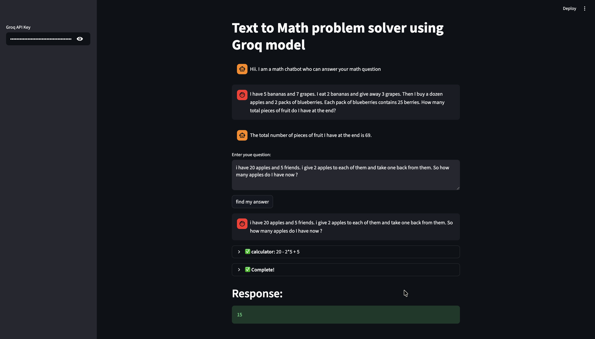

# 🧮 Math Problem Solver & Data Search Assistant

An AI-powered chatbot application built using Streamlit, LangChain, and Groq LLMs that can solve mathematical problems, perform logical reasoning, and retrieve information from Wikipedia using agent-based tool calling.

---

## 🚀 Features

* Solves mathematical and arithmetic problems
* Performs logical and reasoning-based question answering
* Retrieves factual information using Wikipedia
* Interactive Streamlit chat interface
* Uses LangChain Agents with multiple tools
* Real-time response streaming with callbacks
* Powered by Groq's ultra-fast LLM inference

---

## 🛠️ Tech Stack

* Python
* Streamlit
* LangChain
* Groq API
* Wikipedia API Wrapper

---

## 📦 Installation

### 1. Clone the repository

```bash
git clone <https://github.com/charrann12/MathGPT.git>
```

### 2. Create virtual environment

```bash
python3 -m venv venv
```

### 3. Activate virtual environment

#### Mac/Linux

```bash
source venv/bin/activate
```

#### Windows

```bash
venv\Scripts\activate
```

### 4. Install dependencies

```bash
pip install -r requirements.txt
```

---

## ▶️ Run the Application

```bash
streamlit run app.py
```

---

## 🔑 Setup Groq API Key

1. Visit Groq Console
2. Generate an API Key
3. Paste the key into the Streamlit sidebar input

---

## 📂 Project Structure

```bash
.
├── app.py
├── image.png
├── README.md
└── requirements.txt
```

---

## ⚙️ Tools Used Inside the Agent

### 📚 Wikipedia Tool

Fetches factual information and summaries from Wikipedia.

### 🧠 Reasoning Tool

Uses LLM-based logical reasoning for step-by-step solutions.

### ➗ Calculator Tool

Performs mathematical calculations using LangChain's math chain.


---

## User Interface

---

